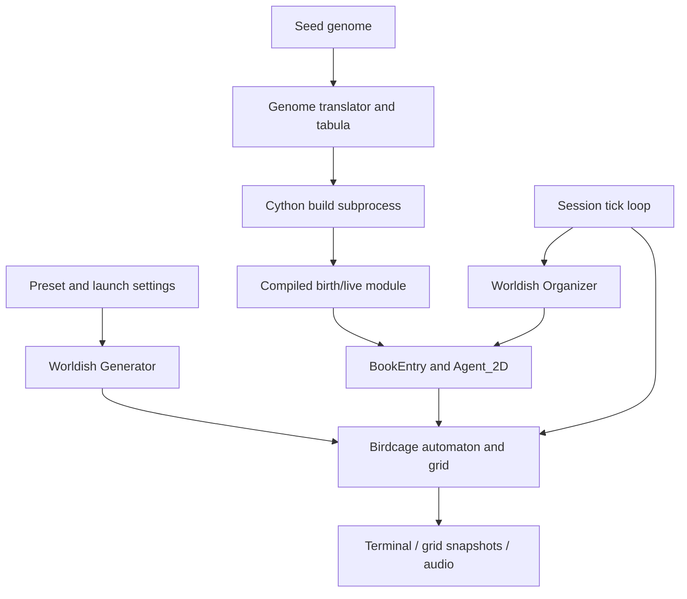

# Ouroborus: current system and evolutionary-language baseline

Status: descriptive snapshot of the source on 2026-09-14, before implementing a new evolutionary language. The final section records discussion options, not accepted architecture. This document accompanies the [digital-life languages survey](../.memory/wiki/notes/digital-life-languages-survey.md). Planned architecture is in the [evolutionary language roadmap](evolution-roadmap.md); ordered implementation work is in the [task list](evolution-tasklist.md).

## 1. What the system does today

Ouroborus runs mobile agents over a changing two-dimensional cellular automaton. The background evolves through a configured neighborhood and transition rule. Agents occupy separate objects, move over that grid, consume eligible cells, accumulate or lose energy, reproduce, and die according to executable behavior generated from a seed genome.

The maintained stack is Python 3 and Cython (the successor to the historical Pyrex implementation). Birdcage supplies the grid, rules, neighborhoods, agents, and genome translator. Worldish assembles these components, manages agent lifecycles, and presents terminal, graphical, and Csound audio output. An optional Qt Quick desktop application manages a separate simulation process.

This is a functioning agent simulation with genome-derived behavior and clonal reproduction. It is not yet a mutation-tolerant evolutionary programming environment. The normal reproduction path does not introduce heritable variation, and arbitrary changes to the existing genome can produce invalid source code. Survival and reproduction occur, but that alone does not establish adaptive evolution or open-ended evolution.

The report's C++ and distributed-system framing describes historical ambitions rather than the current execution path. The C++ component was removed; Circadian is retained for possible revival but is outside the active port. There is no distributed population scheduler in the maintained Worldish session path.

## 2. Component map

| Component | Current responsibility | Source |
| --- | --- | --- |
| Grid topology | Cell storage, coordinate handling and boundary normalization | [topology.pyx](../birdcage/topology.pyx) |
| Neighborhood and rule | Neighbor selection and cell transitions | [neighborhood.pyx](../birdcage/neighborhood.pyx), [rule.pyx](../birdcage/rule.pyx) |
| Automaton | Background updates and a list of instantiated agents | [automaton.pyx](../birdcage/automaton.pyx) |
| Agent body | Position, facing, energy and primitive actions | [agent.pyx](../birdcage/agent.pyx), [agent.pxd](../birdcage/agent.pxd) |
| Genome translation | Fixed-width words translated into source fragments | [genome.pyx](../birdcage/genome.pyx), [code.pyx](../worldish/code.pyx) |
| Generation and lifecycle | Compile strains, create entries, dispatch births/life/death | [GOD.py](../worldish/GOD.py) |
| Per-agent bookkeeping | Bind compiled module, body and lifecycle metadata | [bookentry.py](../worldish/bookentry.py) |
| Initialization and execution | Assemble presets and run the simulation | [sequence_threaded.py](../worldish/sequence_threaded.py), [session.py](../worldish/session.py) |
| Desktop bridge | Worker commands, snapshots and terminal transport | [worker.py](../worldish/worker.py), [controller.py](../worldish/desktop/controller.py) |

## 3. World model and embodied actions

A topology owns cell states. A neighborhood identifies nearby cells, and a rule computes transitions. The synchronous automaton computes a complete next grid in a work grid before copying it back to the live topology. The asynchronous variant applies changes during traversal. These background update semantics are distinct from agent scheduling.

For example, the unmodified Alpha preset selects an 80 by 20 toroidal grid, a Moore neighborhood, an XOR reduction rule, three initial agents, and initial agent energy of 22. Launch settings can override such values as iteration count and random seed; desktop world dimensions and rules still come from presets. See [specific_alpha.py](../worldish/specific_alpha.py) and [config.py](../worldish/config.py).

`Agent_2D` keeps C integer fields for energy (`prana`), the configured `mana` value, position, facing and an eating flag. Its genetic code is a Python object. Body extent (`corporality`) and sensing extent (`sensoriality`) are neighborhood objects sharing the same topology.

The primitive operations include:

- `tellAddress()`, `tellDirections()` and `tellFacing()` for position and neighborhood addresses. These are not a completed agent instruction set for interpreting environmental signals.
- `changeFacing()` and `randomFacing()` for orientation. Facing zero means remaining at the current position; random facing chooses a nonzero direction.
- `advance()` and `move()` for movement, normalized through topology boundaries. These methods do not enforce exclusive cell occupancy or debit movement energy themselves.
- `tellPrana()`, `gainPrana()`, `losePrana()` and `isAlive()` for energy. `losePrana()` clamps negative results to zero; calling `isAlive()` only reports a condition.
- `eatMana()` for consuming the cell under the agent. The implementation specifically checks cell state **1**, adds **5** energy, and resets that cell to the topology's background. Although `mana` is stored on the agent, this operation does not consult it.
- `hasEaten()` for consuming a one-shot notification used by sound bookkeeping.

Agents are not cell states. The automaton maintains a list of bodies, while Worldish maintains a dictionary of lifecycle entries. Multiple bodies can occupy the same location. Consumption changes the shared grid immediately, so earlier agents can remove food before later agents act. The automaton's update return value summarizes background rule results; `tellPopulation()` counts bodies in its agent list.

## 4. The existing genome language

### Representation and translation

The current language is a source-fragment encoding. `Genome(text, table, wordlength)` accepts a list or removes spaces from a string and turns it into a list of symbols. Worldish uses a word length of two. `parse()` prepends `table['boilerplate']`, reads successive two-character words, looks each up in the table, and appends its source fragment plus a newline.

Examples from `worldish.code.tabula`:

| Word | Generated fragment | Meaning |
| --- | --- | --- |
| `Cb` | `def birth(earth, code, prana, mana, address):` | Begin construction function |
| `Ld` | `def live(creature):` | Begin behavior function |
| `Lm` | `  move(creature)` | Invoke movement helper |
| `Le` | `  creature.eatMana()` | Consume food |
| `Iy` | `  if creature.tellPrana() > 27:` | Begin reproductive condition |
| `Ir` | `      prayer = "GrantChild"` | Request offspring |

The fixed boilerplate imports Birdcage classes and selects body/sensor neighborhood classes. A preset can override that boilerplate. Genes encode Python structure as well as actions: function definitions, indentation, conditions, and returns all depend on surrounding genes.

There is no structural repair or safe default for an unknown word in this translator. Invalid words, incomplete final words, or structurally invalid combinations can fail during translation or compilation. Even compilable mutations could introduce runtime failures or nontermination. This is the concrete gap between the current language and a mutation-tolerant virtual machine.

### Compilation and caching

`GOD.Generator` selects a generation strategy from the preset:

- `IndividualCompile` generates a separate compiled module per agent.
- `MassCompile` keeps an in-memory `scions` list of genome values and reuses a strain module for equal values during that generator's lifetime.
- `Void` disables genome compilation for the corresponding configuration.

For a novel compiled genome, the generator writes a `.pyx` file under `creatures/` in the run directory. `compile_genome()` invokes `worldish/_compile.py` with the same Python interpreter in a child process. That script uses setuptools and Cython with Python 3 language semantics to build an extension in place. Build output is appended to `build.log`; a nonzero result raises an error.

`BookEntry.callModule()` imports the resulting extension. The compilation subprocess isolates build machinery, but the compiled behavior subsequently executes inside the simulation process; it is not a per-agent execution sandbox. The cache avoids repeated builds of identical strains, not the cost of compiling each novel strain. The translator removes spaces while the cache compares the supplied genome values, so the cache is not a general canonicalized-genome store.

## 5. Agent lifecycle and timing

### Runtime objects

`BookEntry` contains the imported module, its name, the instantiated body, the automaton reference, and a `fatum` dictionary. The dictionary stores the lifecycle request (`prayer`), code, energy, configured mana, address, and optional audio voice.

`instantiateAgent()` calls the generated module's `birth(automaton, code, prana, mana, address)`. `agentLive()` calls its `live(agent)` function, stores the returned request, refreshes recorded energy/address, and forwards eating information to audio state. It does not execute a virtual instruction stream: each call runs the generated function to completion.

`GOD.Organizer.readBookOfLife()` dispatches the current request to a method named `grantPrayer` plus that request; unrecognized method names fall back to the live handler.

| Request | Handler effect |
| --- | --- |
| `CreateMe` | Fill initial seed code, preset energy/mana, random address and optional voice; set `BeBirthed` |
| `BeBirthed` | Import module, instantiate body, add it to the automaton, count birth; set `Live` |
| `Live` | Run generated behavior and store its next request |
| `GrantChild` | Generate an offspring entry and reset the parent's request to `Live` |
| `KillMe` | Remove body and dictionary entry, count death, discard module/body references |

### Session tick ordering

The desktop uses the shared session execution mode, reusing `ThreadedSequence` initialization. Initialization constructs the world, seeds the background, compiles initial genomes, and processes initial `CreateMe` requests. These entries are then waiting for `BeBirthed`.

Each session tick:

1. Processes transport/pacing permission before entering the tick.
2. Increments `annum` and updates the background automaton.
3. Takes `list(sequence.taw.values())` and processes one lifecycle request for each entry.
4. Performs scheduled agent/background presentation updates and sends a snapshot when due.
5. Checks audio performance status and continues until the iteration limit or stop.

A request returned by `live()` is handled on a subsequent tick, not recursively in the same call. A child added while traversing the entry snapshot is not visited until the next tick. Thus a parent requests reproduction during one tick, creates the child entry during another, and the child is instantiated on a later tick. Death likewise waits for its request to be dispatched.

Agents act sequentially against the shared world in this path. The dictionary snapshot permits births/deaths during traversal; it does not make actions simultaneous. A seed aids repeatability, but the separate experimental threaded mode has timing-dependent behavior and should not be treated as equivalent deterministic execution.

### Concrete Alpha behavior

Decoding Alpha's seed genome yields a body constructor and a live function with this behavior:

1. Start with request `Live`.
2. Choose a random direction and advance.
3. Lose one unit of energy.
4. Attempt to eat, potentially gaining five.
5. If energy now exceeds 27, set request `GrantChild` and invoke a helper that deducts 14 energy.
6. Otherwise, if energy is zero, request `KillMe`.
7. Return the request.

These costs and checks are generated behavior, not mandatory scheduler rules. Eating occurs before the death check, so an agent reduced to zero in step 3 can recover in step 4. Lifecycle-only ticks do not run this live function. Changing the language without identifying these distinctions could silently change ecological behavior.

## 6. Reproduction, selection and current limitations

`grantPrayerGrantChild()` takes the code stored in the parent's `fatum`, passes it unchanged to the generator, and assigns it to the child. The child receives preset `prana` and `mana`, and a uniformly chosen grid address rather than placement next to its parent. There is no mutation or recombination step in this path and no parent-child genealogy recorded by it.

For Alpha, the parent pays 14 in its generated helper while the child is allocated 22 by the organizer. This is not a conserved energy transfer. Likewise the cellular rule creates and removes food states independently of agent energy accounting. The current environment should not be described as a closed, conserved metabolism.

Competition for edible cells can affect survival and reproduction, but current clonal reproduction does not supply genetic variation. There is no instruction allowance, per-agent VM memory limit, standard safe arithmetic policy, offspring genome buffer, or lineage analysis in the maintained lifecycle. Energy checks reside in generated code, so a future mutation system cannot assume that every program will voluntarily pay costs or request death.

## 7. Presentation, process boundaries and observability

The optional PySide6/Qt Quick desktop runs separately from its managed worker. Curses output travels through a Linux PTY; a separate versioned local socket protocol carries commands, state changes, errors and world snapshots. The Living grid view consumes snapshots without owning simulation state. See [desktop architecture](desktop-architecture.md).

The worker executes session ticks and curses on its main thread. Csound performance and background audio producers are managed in that process. Initial genome preparation happens before playback begins, avoiding premature exhaustion of silent audio during compilation. Pause stops simulation ticks and mutes output while the musical clock continues; single-step advances a complete simulation tick, not one agent instruction.

The existing CLI also retains debug, visual, audiovisual, threaded and experimental modes. The normal threaded mode performs simulation work in a thread and dispatches display work to the main thread. The session description above should not be assumed to describe every historical sequence identically.

The launcher changes into an output directory (default `.worldish`), configures the preset and RNG, and sets up logs and generated-module imports. Concurrent runs need different directories. Configuration still relies on module globals and import order; the desktop worker provides process isolation rather than a fully independent, reusable in-process simulation object.

Current observability includes:

- `build.log`, generated genomes/extensions and `debug_output.txt` in the run directory.
- `result.json` containing completed iterations, final population, births, deaths and a compilation-count field. Initial instantiated agents count as births.
- Worker snapshots containing tick, population, births/deaths, dimensions, Booleanized cell states and body-covered coordinates. These are display data, not complete checkpoints: they omit genome identity, VM state, ancestry, and per-agent energy.
- Saved desktop settings, which are launch configuration rather than serialized living worlds.

## 8. Language discussion and planned direction

The survey is useful as a catalog, but its recommendation of a drop-in language does not account for this runtime's lifecycle, energy semantics and module interface. Mutation-safe execution also does not guarantee mutant survival, adaptive behavior or open-ended evolution. No performance ranking among candidate interpreters has been measured here.

Four avenues were discussed:

| Avenue | Possible implementation | Question to resolve |
| --- | --- | --- |
| Push-inspired interpreter | Linear genome, typed stacks, bounded execution and world instructions | Which types, control operations and persistent state are initially needed? |
| Small register machine | Compact opcodes, registers, instruction pointer and robust branching | How much low-level replication/control machinery should agents express? |
| Structured evolution of the existing language | Mutate valid blocks and generate structurally correct source | Are restricted variation and compilation per novel strain acceptable? |
| Regulatory/chemical execution | Tagged rules activated by signals or concentrations | Is changing the scheduling/metabolic model part of the intended experiment? |

The planned order is now to create a forager specificity, establish a compiled forager with exact offspring energy transfer, add framework execution-method selection with compilation as the default, and then implement interpretation. A Push-inspired machine remains a candidate; detailed instruction and compute-cost policies are not finalized. A possible integration would replace the module-specific calls behind `BookEntry` with an explicit controller interface, retain Birdcage bodies/worlds, and route birth/death through the organizer. This interface does not exist yet. Both a stack machine and a register machine could eventually use it.

A first interpreter experiment could use integer/Boolean values, sensing, turning, movement, eating and reproduction requests. Persistent execution state, instruction budgets, stack/code limits and defined exceptional behavior would need explicit semantics. Python could serve as a reference implementation before measured hotspots move to Cython; neither speed nor population capacity is established in advance.

Before implementation, decide:

1. **Behavior versus reproduction machinery:** does the world copy/mutate genomes on request, or must organisms construct offspring code themselves? The discussion suggested beginning with world-managed copying and later adding offspring construction.
2. **Ecological enforcement:** which costs and death rules belong to the world rather than voluntary program behavior? Should births be local, and how is energy transferred?
3. **Scheduling:** what constitutes an instruction, how much computation/actions fit in a tick, what persists between ticks, and how are contested actions ordered?
4. **Variation and measurement:** mutation alphabet/operators, maximum genome size, parent/strain identity, behavioral diversity, survival across seeds and throughput.
5. **Compatibility:** preserve the existing presets as a baseline, or deliberately change their reproduction and energy semantics under a separate experimental configuration?

The first behavioral checkpoint is a hand-authored compiled forager; the later interpreter must run the same organism. Mutation and lineage tracking follow validation of both execution methods. These are future experiments, not functionality present in this snapshot. No new language, reproduction policy or ecological rule was implemented while writing this document.
