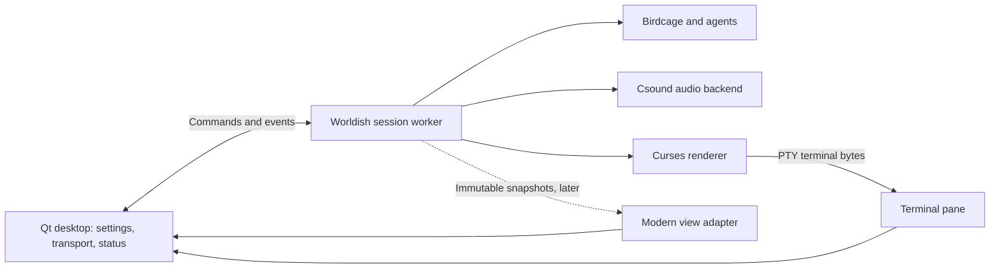

# Ouroborus desktop architecture proposal

Status: accepted by the user on 2026-09-13. The initial working desktop implementation is complete. The original proposal follows this implementation status.

## Implementation status

- PySide6 6.11.2 / Qt Quick shell, purple/green styling, scrollable settings and fixed transport controls.
- Linux PTY-hosted curses via pyte 0.8.2, plus a snapshot-driven Living grid renderer; switching views preserves the world.
- Separate managed worker and versioned socket-pair protocol; startup phases, metrics, failures and isolated run directories.
- Validated launch settings, JSON save/load, start/stop, pause/resume, single tick, live pacing, volume and mute. Specificity/seed/iteration/output edits apply on the next run; Stop then Start applies them.
- Shared `session` CLI execution mode reuses legacy initialization and lifecycle helpers. It runs ticks and curses on the worker's main thread, with Csound/background threads owned by that process. The old CLI modes remain intact.
- Pause freezes simulation ticks and smoothly mutes audio while the musical clock continues. It does not promise sample-exact audio pause/resume. The master attenuation channel defaults to full gain for standalone CSD users.
- A 20-second audio-device startup timeout and bounded process-group shutdown prevent a stalled backend or compilation from stranding the UI. Desktop audio prefers PulseAudio when its socket exists, otherwise PortAudio; WORLDISH_AUDIO_BACKEND can explicitly select pulse, pa, alsa or jack.

World dimensions, rules and initial populations still come from the existing specificities. Arbitrary world/genome editing, device enumeration, graphical zoom/panning and full removal of legacy module globals remain future work. The current grid fits the complete world into its pane. The terminal is a Worldish-compatible view, not a general-purpose terminal application.

Validation on 2026-09-13: 88 tests passed without skips. Headless integration checks cover real genomes, terminal resizing, paused tick stability, single-step, worker stop/crash/restart, alternate-screen colors/Unicode, settings and minimum-window layout. Screenshots of both renderers were inspected. Silent Csound runs and stereo WAV gain/mute checks pass. Manual validation reported on 2026-09-14 confirms that the windowed application runs with audible sound.

## Experience

A single desktop window contains a fixed left configuration sidebar, a large simulation view, and a compact status strip. The first view hosts the actual curses renderer. Audio runs with the simulation, independently of the selected visual renderer.

```text
┌─ OUROBORUS                         ● Running       ─ □ × ┐
│ Configuration       │ Terminal ▾                       │
│ Specificity: Alpha ▾│                                  │
│                    │                                  │
│ ▸ World            │          simulation view         │
│ ▸ Agents           │                                  │
│ ▸ Timing           │                                  │
│ ▸ Sound            │                                  │
│ Seed: 1234    ⚄    │                                  │
│                    │                                  │
│ ▶ Play  Ⅱ Pause    ├──────────────────────────────────┤
│ Step   ■ Stop      │ Tick 240 · Agents 18 · Audio on  │
└────────────────────┴──────────────────────────────────┘
```

The sidebar is approximately 280 logical pixels wide, with collapsible groups and a persistent transport section. The Specificity selector chooses the existing world configurations. Show the current run's seed, configuration, and state explicitly. Configuration edits form a draft; changes requiring a restart should offer an explicit apply-and-restart action. Save/load settings can use versioned JSON rather than executable Python configuration files.

Use an aubergine background (#140D21), raised panels (#241536), bright purple (#B04CFF) for the application header, selections and focus outlines, acid green (#B6FF3B) for play and activity, and pale text (#F1EAFE). Put dark text on bright accent buttons. Keep the simulation canvas dark and visually quiet. Rounded controls, a seed dice button, and restrained activity pulses provide playfulness. Labels and icons accompany status colors; respect reduced motion and keyboard navigation.

Draw the purple/green decorations within the application's own header and borders. Native outer window decorations depend on the desktop environment. Preserve normal drag, resize, maximize and close behavior; test any custom title bar on Wayland before committing to it. This proposal does not require desktop configuration changes.

## Desktop stack

Use **PySide6 with Qt Quick/QML**: Python controllers expose application state and actions, while QML owns layout and styling. Keep the dependencies in an optional desktop extra. Birdcage remains independent of Qt, and the command-line application remains supported.

Qt documents [Python/QML application integration](https://doc.qt.io/qtforpython-6/tutorials/basictutorial/qml.html) and [customizable controls](https://doc.qt.io/qt-6/qtquickcontrols-customize.html). This dependency combination is now installed and exercised on the current Python 3.14 environment.

## Runtime boundaries



The GUI process owns the Qt event loop. One managed worker process owns a simulation session, generated-genome compilation, and Csound. This contains existing module-global configuration, working-directory changes and native-library failures, and avoids blocking the GUI during compilation. Within the worker, curses stays on its main thread where required by the existing threaded sequence implementation. Existing simulation and audio threads remain worker internals.

Use a dedicated local IPC channel for structured commands and events, separate from terminal bytes and diagnostic logs. A small versioned JSON protocol is sufficient initially. Include request IDs, run IDs, acknowledgments and explicit errors. Define session states such as idle, preparing, running, paused, stopping, finished and failed. Distinguish compilation progress from an actively running simulation.

The desktop owns worker lifecycle: graceful stop, bounded shutdown, and termination of owned compiler children if graceful shutdown fails. Closing the window must not leave simulation or audio processes behind. Report worker failure in the UI with a diagnostics drawer and preserve its run logs.

## Real curses first

Allocate a pseudo-terminal for the worker and render its terminal output in a Qt pane. This retains curses semantics rather than reproducing the renderer by scraping text. Route terminal keyboard input only when that pane has focus. Resize the PTY along with the pane and notify the worker.

[pyte](https://pyte.readthedocs.io/en/latest/) is a candidate headless terminal parser, not a finished GUI terminal widget. A small Qt drawing adapter would render its cell buffer. Before building the full shell, test the actual Worldish output, alternate-screen handling, colors, cursor behavior, keyboard input, Unicode, resizing and high-DPI rendering. If compatibility or maintenance cost is poor, select an established terminal component instead. The PTY approach is Linux-first; Windows would require a different terminal backend.

The first compatibility milestone can launch existing CLI modes with validated arguments and provide start, stop and restart. It does not automatically provide pause, stepping or live configuration: those require the session API below. Do not expose unfinished controls as if they work.

## Session and renderer API

Gradually extract configuration and session ownership from `runtime.py`, `GOD.py` and the sequence modules. Introduce an explicit `SimulationConfig` and `SimulationSession`, with a defined tick boundary and commands for pause, resume, single step and stop. The CLI and desktop should use the same session interface.

Separate state updates from display callbacks. Publish immutable snapshots containing grid state, agent positions, tick number and metrics. Start with bounded snapshot queues and coalesce obsolete frames; do not drop control acknowledgments or lifecycle events. Measure snapshot-copy cost before adopting shared memory. A modest internal renderer registry is sufficient: Terminal first, then a 2D grid/heatmap view, with more ambitious renderers later.

Modern views consume snapshots at their own display rate while simulation ticks remain authoritative. Once this seam exists, switching a renderer should preserve the running world. During the initial compatibility phase, renderer selection may be fixed at launch.

Keep audio driven by simulation events and its own performance clock, never by visual redraws. Preserve the existing rule that Csound performance begins only after genome compilation and session initialization complete. Pause needs an explicit policy that freezes simulation advancement and fades or mutes sustained audio; resuming restores it coherently. Do not implement pause by suspending the entire process.

## Configuration semantics

| Setting | Proposed behavior |
| --- | --- |
| World dimensions, topology, rules, genomes, initial population, seed | Validate as a draft; apply on restart |
| Simulation pace | Apply at a tick boundary once the session API exists |
| Pause and single step | Session commands; step advances one defined simulation tick |
| Volume and mute | Live audio controls, independent of redraws |
| Audio device | Controlled backend restart; initially configure while stopped |
| View palette and zoom | Immediate local view changes where supported |
| Renderer | At launch initially; live switching after snapshot extraction |

Audio controls should reflect backend capabilities. A curses pane supports font scaling, not necessarily graphical world zoom. Show unsupported actions as unavailable with a short explanation. Do not display fabricated audio meters or metrics; add them when telemetry exists.

## Suggested source layout

```text
worldish/
  config.py             # validated session configuration
  session.py            # simulation lifecycle and tick boundary
  protocol.py           # desktop/worker commands and events
  worker.py             # worker entry point and cleanup
  desktop/
    app.py              # Qt startup
    controller.py       # process ownership and UI state
    qml/                # shell, sidebar, transport, theme
    views/              # terminal first, snapshot renderers later
```

These are proposed additions, not a requirement to reorganize all existing modules at once. Keep the website and Circadian outside this work, within the current cohesive repository.

## Delivery order and validation

1. **Compatibility spike:** launch a real curses example with audio inside a minimal Qt terminal pane. Verify dependency installation on the current Python version, resizing, keyboard focus, Wayland behavior and complete shutdown.
2. **Usable shell:** add the purple/green layout, specificity selection, validated launch settings, start/stop/restart, logs and accurate state reporting. Preserve the current CLI.
3. **Session controls:** extract the shared session interface; implement pause, step, pacing, volume, settings and metrics with explicit semantics.
4. **Modern renderer:** add a 2D grid view using snapshots and verify renderer switching preserves session state and audio.

Retain the existing regression suite. Add focused coverage for protocol/state transitions, compilation delays before audio playback, stop during initialization, worker failure, child-process cleanup and tick behavior while paused. Exercise real terminal resizing and actual audio playback manually. A passing headless suite does not establish speaker output or desktop behavior. See the implementation status above for completed checks.
